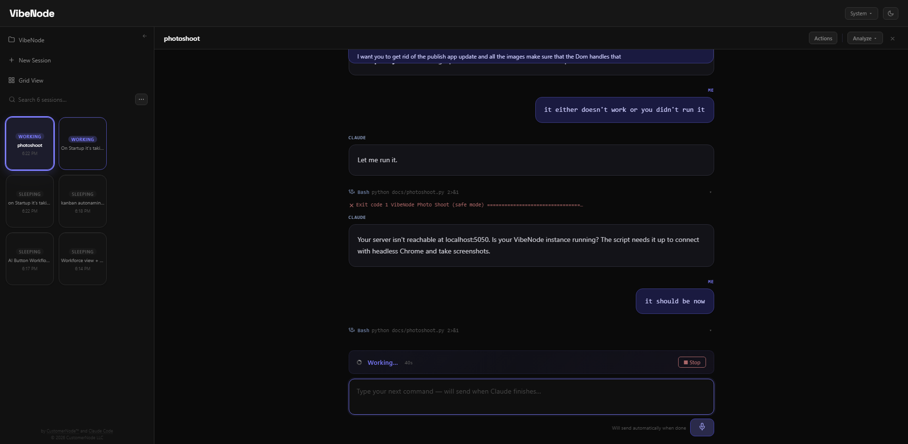

# VibeNode

A local development environment for Claude Code — session management, hierarchical task planning, and a workflow board where your task tree terminates in working Claude sessions. Built by [CustomerNode](https://customernode.com) and [Claude Code](https://claude.ai/download).


## Why we built this

Two problems:

1. **Session sprawl.** Running 8+ Claude Code sessions across terminal windows gets unwieldy fast — especially permission management. Even a three-monitor setup runs out of space. We needed a way to graphically manage sessions without sprawling terminals everywhere.

2. **Velocity without direction.** Claude Code is powerful, but we noticed our roadmap wasn't actually moving faster. Sessions would drift, work would get duplicated, and there was no connection between what Claude was doing and what we needed delivered. We needed sessions tightly coupled to a task plan so every session is working toward a specific deliverable.

VibeNode is the result: a development system where the human is responsible for planning, oversight, and validating outputs, while Claude handles execution — scoped to tasks, not left to wander. The session manager makes pure vibe coding better on its own, but the workflow board is where it becomes vibe *engineering* — structured planning and validation with a human in the loop.

## What it does

- Lists all your Claude Code sessions with live state (Working / Idle / Question / Sleeping)
- Live terminal panel — watch Claude work in real time
- Answer Claude's questions directly from the browser (with clickable option buttons)
- Send commands to running sessions
- Session tools: auto-name, duplicate, fork, rewind, delete, summarize, extract code, compare sessions

### View modes

**Grid** — Visual cards showing session status at a glance. The default view.

**List** — Compact table with name, date, and size columns. Good for large session counts.


**Workflow** — A full hierarchical task board for managing your development roadmap. Tasks are organized into configurable columns (Not Started, Working, Validating, Remediating, Complete by default) with drag-and-drop between them. Key capabilities:

- **Hierarchical tasks** — Arbitrary nesting depth. Break epics into tasks into subtasks. Each level tracks its own status independently, with completion propagating up automatically.
- **Session scoping** — Sessions are integrated into the task tree itself. At any branch, a task can break into either subtasks or Claude Code sessions — so the leaf nodes of your hierarchy become actual working sessions instead of more tasks. Spawn a session from any task card and context (breadcrumb path, sibling tasks, parent description) is injected automatically. This is fundamentally different from tools that bolt sessions on as an afterthought — here the board structure *is* the session structure.


- **AI planner** — Describe work in natural language and Claude breaks it into a hierarchical task tree. Because it runs through Claude Code, it can read your codebase while planning — so the task breakdown reflects your actual architecture, not just your description. Iterate on the breakdown, then accept to bulk-create. Supports voice input.
- **Dual storage backends** — SQLite (default, zero config, local file at `~/.claude/gui_kanban.db`) or Supabase (cloud PostgreSQL). Switch between them in System Settings with one-click migration.
- **Collaborative with Supabase** — When using Supabase, multiple people can connect to the same board, making it a persistent and collaborative development roadmap. Task ownership tracking and per-user identity via git config.
- **Cloud backups** — When using Supabase, download snapshots of your cloud data to local JSON files (`backups/` folder) with one click. Restore from any previous backup to roll back your board state. Backup files include full metadata and record counts for easy identification.
- **Built for scale** — Paginated columns, indexed queries, recursive CTEs for tree traversal, gap-numbered positioning for drag reorder. Designed to handle thousands of tasks without degradation.
- **Configurable columns** — Rename, reorder, recolor, add, or remove workflow columns per project. Per-column sort mode (manual drag, date entered, date created, alphabetical).
- **Reports & analytics** — Velocity, cycle time, status breakdown, remediation rate, tag distribution, completion trends, workload analysis, and more.
- **Multi-session coordination** — When a session launches from a task, it gets a briefing that includes sibling task statuses, which siblings have active sessions running (and for how long), open validation issues, and the full breadcrumb path up the task tree. Claude can see what's being worked on nearby and avoid conflicts — parallel sessions on related tasks are aware of each other.
- **Tags, issues, and validation** — Tag tasks for filtering, log validation issues against tasks, track resolution status.

**Workforce** *(experimental)* — Claude Code has two similar concepts — skills and agents — that don't translate naturally to a graphical environment. Workforce is our solution: a hierarchical knowledge base where each node has its own scoped instruction file (like a skill/agent MD file). Sessions launched from a node inherit that context, and Claude can see the full workforce tree to delegate work across it. You can scope tasks or sessions to any node in the hierarchy — clicking into a department to launch a session works like invoking a skill, while Claude autonomously dispatching work across the tree works like agents.

### Live session panel

Watch Claude work in real time, answer questions, and send follow-up commands — all from the browser.



## Requirements

- Python 3.10+
- Claude Code installed and at least one session created
- Windows, macOS, or Linux

## Setup (AI-assisted — recommended)

If you have [Claude Code](https://docs.anthropic.com/en/docs/claude-code) installed, open your terminal and tell Claude:

> Get me set up with https://github.com/CustomerNode/VibeNode

Claude handles the rest — cloning the repo, installing Python and Flask if needed, creating a desktop shortcut, and launching VibeNode for you.

See [FileTaskNode](https://github.com/CustomerNode/FileTaskNode) for an example of a Claude Code workspace built around this kind of AI-assisted setup.

## Setup (manual)

### 1. Clone and install

```bash
git clone https://github.com/CustomerNode/VibeNode.git
cd VibeNode
pip install flask
```

### 2. Run

```bash
python session_manager.py
```

The browser opens automatically to http://localhost:5050.

### 3. Desktop shortcut (Windows)

Run this once in PowerShell to create a desktop shortcut that launches VibeNode with one click:

```powershell
$WshShell = New-Object -ComObject WScript.Shell
$Shortcut = $WshShell.CreateShortcut("$env:USERPROFILE\Desktop\VibeNode.lnk")
$Shortcut.TargetPath = (Get-Command pythonw).Source
$Shortcut.Arguments = "`"$env:USERPROFILE\Documents\VibeNode\session_manager.py`""
$Shortcut.WorkingDirectory = "$env:USERPROFILE\Documents\VibeNode"
$Shortcut.IconLocation = "$env:USERPROFILE\Documents\VibeNode\vibenode.ico,0"
$Shortcut.WindowStyle = 7
$Shortcut.Save()
```

Uses `pythonw.exe` (windowless) so no console flashes on launch. When you click the shortcut, a boot splash window shows real-time startup progress (clearing caches, checking dependencies, starting the session daemon, etc.) and automatically dismisses once the browser opens. The app self-heals this shortcut on every startup — if you created it with `python` instead, it will be silently upgraded to `pythonw` next time you run VibeNode.

### 4. Desktop shortcut (macOS)

Create an alias in your Applications folder:

```bash
ln -s ~/Documents/VibeNode/launch.sh /Applications/VibeNode
```

Or create a clickable `.command` file on your Desktop:

```bash
echo '#!/bin/bash
cd ~/Documents/VibeNode && ./launch.sh' > ~/Desktop/VibeNode.command
chmod +x ~/Desktop/VibeNode.command
```

### 5. Desktop shortcut (Linux)

Create a `.desktop` file:

```bash
cat > ~/.local/share/applications/vibenode.desktop << 'EOF'
[Desktop Entry]
Name=VibeNode
Exec=bash -c 'cd ~/Documents/VibeNode && ./launch.sh'
Icon=~/Documents/VibeNode/static/claudecodegui.ico
Type=Application
Terminal=false
EOF
```

## Platform support

**Windows, macOS, and Linux.** VibeNode was originally developed on Windows and has been adapted for cross-platform support. All session management is handled through the Claude Code SDK, so the core functionality is fully cross-platform.

| Feature | Windows | macOS | Linux |
|---|---|---|---|
| Process detection | PowerShell WMI | `ps` | `ps` |
| Port cleanup | `netstat` + `taskkill` | `lsof` + `kill` | `lsof` + `kill` |
| Server restart | PowerShell | `bash` + `nohup` | `bash` + `nohup` |
| Browser launch | Chrome / fallback | `open` | `xdg-open` |
| Auth login | `cmd` window | Terminal.app | `gnome-terminal` / `xterm` |
| Boot splash | tkinter window | tkinter window | tkinter (falls back to `notify-send`) |
| Desktop shortcut | `.lnk` (auto-healed) | — | — |
| Background launch | `pythonw.exe` | `nohup` | `nohup` |

### macOS and Linux users

VibeNode was developed and primarily tested on Windows. macOS and Linux support has been added with explicit platform branching, but there may be minor setup bugs on your platform. The Claude Code self-setup flow should identify and patch most issues automatically.

If you run into a platform-specific bug, please submit a pull request with the fix — or ask your Claude to submit one — so we can support everyone. See [CONTRIBUTING.md](CONTRIBUTING.md) or open an issue.

## Notes

- Sessions are read from `~/.claude/projects/`
- Session input is managed through the Claude Code SDK
- VibeNode itself stores everything locally. Claude Code sessions communicate with Anthropic's API as usual. Enabling Supabase cloud storage for tasks is optional.
