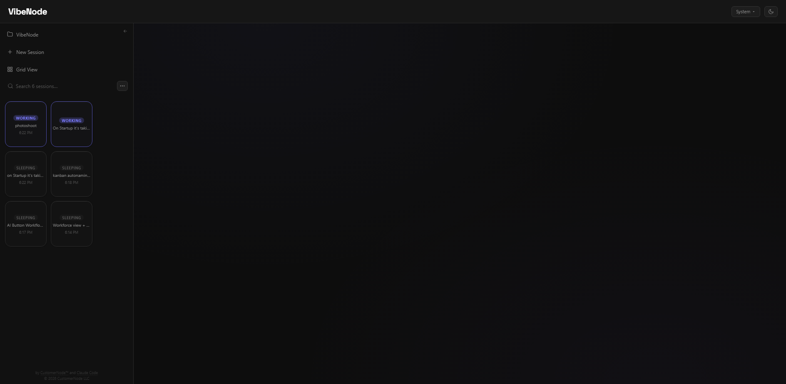
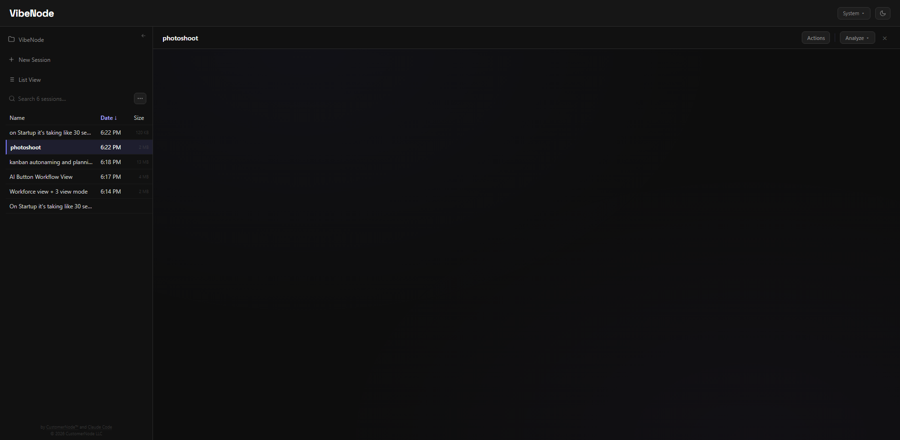
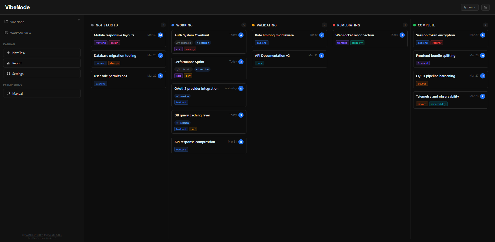
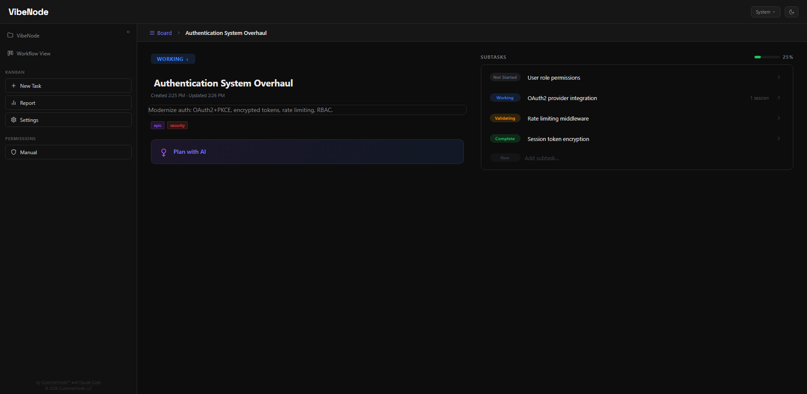

# VibeNode

Session orchestrator UI for Claude Code — manage parallel sessions that are aware of each other and avoid conflicts automatically, a hierarchical task board where your roadmap terminates in working Claude sessions, and a unified knowledge asset library that brings skills and agents together. Built by [CustomerNode](https://customernode.com) and [Claude Code](https://claude.ai/download).


## Why we built this

Three problems:

1. **Session sprawl.** Running 8+ Claude Code sessions across terminal windows gets unwieldy fast — especially permission management. Even a three-monitor setup runs out of space. We needed a way to graphically manage sessions without sprawling terminals everywhere.

2. **Velocity without direction.** Claude Code is powerful, but we noticed our roadmap wasn't actually moving faster. Sessions would drift, work would get duplicated, and there was no connection between what Claude was doing and what we needed delivered. We needed sessions tightly coupled to a task plan so every session is working toward a specific deliverable.

3. **Scattered, invisible knowledge assets.** Claude Code has skills and agents — two nearly identical concepts (markdown files with instructions) that differ only in invocation method. The distinction is confusing, and they live as scattered files across `.claude/` directories with no discoverability. There's no way to browse what's available, see how they're organized, or invoke them without memorizing names. We needed a visual library that treats them as one thing, organizes them into departments, and lets you build, browse, import, and invoke them without caring whether they run inline or as a subprocess.

VibeNode is the result: a development system where the human is responsible for planning, oversight, and validating outputs, while Claude handles execution — scoped to tasks, not left to wander. The session manager makes pure vibe coding better on its own, but the workflow board is where it becomes vibe *engineering* — structured planning and validation with a human in the loop.

## What it does

VibeNode is built around three pillars — **Sessions**, **Workflow**, and **Workforce** — each accessible from a homepage that serves as your command center.

### Sessions

Run and interact with your Claude Code sessions. This is the full interactive terminal experience — not just a list of sessions, but where you actually work.

- Lists all sessions with live state (Working / Idle / Question / Sleeping)
- Live terminal panel — watch Claude work in real time
- Answer Claude's questions directly from the browser (with clickable option buttons)
- Send commands to running sessions
- Session tools: auto-name, duplicate, fork, rewind, delete, summarize, extract code, compare sessions
- Display as visual grid cards or compact list — switch anytime from the sidebar menu
- **Cross-session awareness** — Every session in a project knows what the other sessions are doing. At session start, each session's system prompt is injected with a live snapshot of all other active sessions in the same project: their auto-generated names, current status, how long they've been running, and the last few files they've edited. When sessions are touching the same files, the overlap is flagged explicitly — the AI sees the conflict, re-reads the file before editing, and if the file is unstable mid-refactor, backs off and surfaces the incomplete work to the user instead of creating merge conflicts. No inter-session messaging, no coordination protocol — just awareness and smart avoidance. Toggle it on or off in System Preferences.

Sessions can be displayed as visual grid cards or a compact list — switch anytime from the sidebar menu.



Or switch to a compact list view:




### Workflow

A full hierarchical task board for managing your development roadmap. Tasks are organized into configurable columns (Not Started, Working, Validating, Remediating, Complete by default) with drag-and-drop between them. Key capabilities:



- **Hierarchical tasks** — Arbitrary nesting depth. Break epics into tasks into subtasks. Each level tracks its own status independently, with completion propagating up automatically.
- **Session scoping** — Sessions are integrated into the task tree itself. At any branch, a task can break into either subtasks or Claude Code sessions — so the leaf nodes of your hierarchy become actual working sessions instead of more tasks. Spawn a session from any task card and context (breadcrumb path, sibling tasks, parent description) is injected automatically. This is fundamentally different from tools that bolt sessions on as an afterthought — here the board structure *is* the session structure.

Drill into any task to see its subtasks with status tracking and a progress bar:



Tasks can also branch into sessions instead of subtasks — the leaf nodes of your hierarchy become working Claude sessions:


New tasks start with a chooser — break into subtasks, spawn sessions directly, or let AI plan the breakdown:


Open a session from the board and the full breadcrumb path stays visible, keeping the conversation scoped to its place in the hierarchy:


- **AI planner** — Describe work in natural language and Claude breaks it into a hierarchical task tree. Because it runs through Claude Code, it can read your codebase while planning — so the task breakdown reflects your actual architecture, not just your description. Iterate on the breakdown, then accept to bulk-create. Supports voice input.
- **Dual storage backends** — SQLite (default, zero config, local file at `~/.claude/gui_kanban.db`) or Supabase (cloud PostgreSQL). Switch between them in System Settings with one-click migration.
- **Collaborative with Supabase** — When using Supabase, multiple people can connect to the same board, making it a persistent and collaborative development roadmap. Task ownership tracking and per-user identity via git config.
- **Cloud backups** — When using Supabase, download snapshots of your cloud data to local JSON files (`backups/` folder) with one click. Restore from any previous backup to roll back your board state. Backup files include full metadata and record counts for easy identification.
- **Built for scale** — Paginated columns, indexed queries, recursive CTEs for tree traversal, gap-numbered positioning for drag reorder. Designed to handle thousands of tasks without degradation.
- **Configurable columns** — Rename, reorder, recolor, add, or remove workflow columns per project. Per-column sort mode (manual drag, date entered, date created, alphabetical).
- **Reports & analytics** — Velocity, cycle time, status breakdown, remediation rate, tag distribution, completion trends, workload analysis, and more.
- **Multi-session coordination** — When a session launches from a task, it gets a briefing that includes sibling task statuses, which siblings have active sessions running (and for how long), open validation issues, and the full breadcrumb path up the task tree. This is layered on top of the project-wide cross-session awareness (see Sessions above) — so workflow sessions get both a task-neighborhood view of their siblings *and* a bird's-eye view of everything running across the project, with file-level overlap detection and automatic conflict avoidance.
- **Tags, issues, and validation** — Tag tasks for filtering, log validation issues against tasks, track resolution status.

### Workforce

Claude Code has two similar concepts — skills and agents — that are really the same thing: a markdown file with instructions. The only difference is how they're invoked: skills inject into your current session, agents spawn a subprocess. Multiple voices in the community have been [arguing for convergence](https://vivekhaldar.com/articles/claude-code-subagents-commands-skills-converging/) — and [Vercel's research](https://vercel.com/blog/agents-md-outperforms-skills-in-our-agent-evals) showed that both are ultimately context delivery mechanisms that differ only in push vs. pull.

**We're opinionated about this.** VibeNode doesn't ask you to think in terms of skills vs. agents. We call them **departments** — named collections of knowledge assets organized by function. Drop any `.md` file into a department — a one-line persona, a Claude Code agent definition, a gstack review pipeline — and VibeNode handles both invocation paths transparently. You click a department to browse it, click an asset to invoke it, and never choose between "run as skill" or "spawn as agent." We're not claiming this is the objectively correct abstraction. It's how we think about it, and it works.


- **Departments, not file types** — The organizing unit is the department (Engineering, QA, Security, gstack, etc.), not whether something is a "skill" or an "agent." Import a skill file, an agent file, or a full pipeline into any department. VibeNode treats them all the same.
- **Dual invocation** — Every asset can be used two ways from the same definition. As an **agent**: the full catalog is injected into every session's system prompt so Claude can spawn specialists autonomously. As a **skill**: you invoke on demand via the UI or slash commands, and the asset's instructions are injected into your current session. You don't pick — VibeNode decides based on context.
- **Import anything** — Drop in Claude Code agent files (from `.claude/agents/`), skill packs (from `.claude/skills/`), or full execution pipelines like [gstack](https://github.com/garrytan/gstack). They all land in departments. gstack's 23+ skills become a "gstack" department with sub-departments for review, QA, security, shipping, and more.
- **Auto-discovery** — VibeNode scans your `.claude/agents/`, `.claude/skills/` (including installed skill packs), and its own workforce directories on startup. Everything appears in one unified view with source badges and tier indicators. Install a skill pack and it shows up in your departments automatically.
- **Three complexity tiers** — Simple role prompts (one paragraph persona), structured skills (step-by-step workflows with tool permissions), and full pipelines (multi-phase execution with shell blocks, specialist dispatch, and external dependencies). All three tiers live in the same department tree and use the same invocation paths.
- **Portable .md format** — Every asset is a markdown file with optional YAML frontmatter. Download them, share them, upload them, edit them in any text editor. The file format is a superset that accommodates everything from Claude Code's native agent format to gstack's SKILL.md pipeline format.

## Requirements

- Python 3.10+
- Claude Code installed and at least one session created
- Windows, macOS, or Linux

## Setup (AI-assisted — recommended)

If you have [Claude Code](https://docs.anthropic.com/en/docs/claude-code) installed, open your terminal and tell Claude:

> Get me set up with https://github.com/CustomerNode/VibeNode

Claude handles the rest — cloning the repo, installing Python and Flask if needed, creating a desktop shortcut, and launching VibeNode for you.

See [FileTaskNode](https://github.com/CustomerNode/FileTaskNode) for an example of a Claude Code workspace built around this kind of AI-assisted setup.

## Setup (manual)

### 1. Clone and install

```bash
git clone https://github.com/CustomerNode/VibeNode.git
cd VibeNode
pip install -r requirements.txt
```

### 2. Run

```bash
python session_manager.py
```

The browser opens automatically to http://localhost:5050.

### 3. Desktop shortcut (Windows)

Run this once in PowerShell to create a desktop shortcut that launches VibeNode with one click:

```powershell
$WshShell = New-Object -ComObject WScript.Shell
$Shortcut = $WshShell.CreateShortcut("$env:USERPROFILE\Desktop\VibeNode.lnk")
$Shortcut.TargetPath = (Get-Command pythonw).Source
$Shortcut.Arguments = "`"$env:USERPROFILE\Documents\VibeNode\session_manager.py`""
$Shortcut.WorkingDirectory = "$env:USERPROFILE\Documents\VibeNode"
$Shortcut.IconLocation = "$env:USERPROFILE\Documents\VibeNode\vibenode.ico,0"
$Shortcut.WindowStyle = 7
$Shortcut.Save()
```

Uses `pythonw.exe` (windowless) so no console flashes on launch. When you click the shortcut, a boot splash window shows real-time startup progress (clearing caches, checking dependencies, starting the session daemon, etc.) and automatically dismisses once the browser opens. The app self-heals this shortcut on every startup — if you created it with `python` instead, it will be silently upgraded to `pythonw` next time you run VibeNode.

### 4. Desktop shortcut (macOS)

Create an alias in your Applications folder:

```bash
ln -s ~/Documents/VibeNode/launch.sh /Applications/VibeNode
```

Or create a clickable `.command` file on your Desktop:

```bash
echo '#!/bin/bash
cd ~/Documents/VibeNode && ./launch.sh' > ~/Desktop/VibeNode.command
chmod +x ~/Desktop/VibeNode.command
```

### 5. Desktop shortcut (Linux)

Create a `.desktop` file:

```bash
cat > ~/.local/share/applications/vibenode.desktop << 'EOF'
[Desktop Entry]
Name=VibeNode
Exec=bash -c 'cd ~/Documents/VibeNode && ./launch.sh'
Icon=~/Documents/VibeNode/static/vibenode.ico
Type=Application
Terminal=false
EOF
```

## Platform support

**Windows, macOS, and Linux.** VibeNode was originally developed on Windows and has been adapted for cross-platform support. All session management is handled through the Claude Code SDK, so the core functionality is fully cross-platform.

| Feature | Windows | macOS | Linux |
|---|---|---|---|
| Process detection | PowerShell WMI | `ps` | `ps` |
| Port cleanup | `netstat` + `taskkill` | `lsof` + `kill` | `lsof` + `kill` |
| Server restart | PowerShell | `bash` + `nohup` | `bash` + `nohup` |
| Browser launch | Chrome / fallback | `open` | `xdg-open` |
| Auth login | `cmd` window | Terminal.app | `gnome-terminal` / `xterm` |
| Boot splash | tkinter window | tkinter window | tkinter (falls back to `notify-send`) |
| Desktop shortcut | `.lnk` (auto-healed) | — | — |
| Background launch | `pythonw.exe` | `nohup` | `nohup` |

### macOS and Linux users

VibeNode was developed and primarily tested on Windows. macOS and Linux support has been added with explicit platform branching, but there may be minor setup bugs on your platform. The Claude Code self-setup flow should identify and patch most issues automatically.

If you run into a platform-specific bug, please submit a pull request with the fix — or ask your Claude to submit one — so we can support everyone. See [CONTRIBUTING.md](CONTRIBUTING.md) or open an issue.

## Architecture

VibeNode runs as two processes on your machine: a Flask web server (port 5050) serving the UI, and a session daemon (port 5051) that owns all Claude sessions. The daemon survives web server restarts so active sessions are never interrupted. Each Claude session is an asyncio task on a single shared event loop, with its own CLI subprocess communicating via stdio. The web server proxies all session operations to the daemon over a TCP/JSON-lines IPC channel.

This separation means **VibeNode can code itself** — multiple Claude sessions can edit VibeNode's own source files simultaneously, restart the web server to pick up changes, and keep working without interrupting each other. The daemon holds all active sessions in memory while the web server restarts around it. Most of VibeNode was built this way: from inside VibeNode.


**Key design decisions:**

- **One event loop, N sessions.** Claude sessions are I/O-bound (waiting for CLI stdout), so asyncio cooperative scheduling gives us unlimited concurrency on a single thread with no inter-session threading bugs.
- **Daemon separation.** The daemon is a detached subprocess. Web server restarts (code changes, crashes) don't kill running sessions. Crash recovery restores sessions from a registry file on disk.
- **Three-thread IPC bridge.** The DaemonClient uses a reader thread (TCP socket), an emitter thread (SocketIO broadcasts), and a queue between them. This prevents slow WebSocket writes from blocking IPC response processing.
- **Heavy I/O offloaded.** File snapshots, JSONL parsing, and directory scans run in a ThreadPoolExecutor so they don't block the event loop and stall other sessions.
- **Four SDK monkey-patches.** The Claude Code SDK was designed for single-turn CLI usage. VibeNode patches it at runtime for multi-turn sessions (keep stdin open), permission protocol compatibility (CLI 2.x format), unknown message tolerance, and Windows no-window subprocess spawning.

## Notes

- Sessions are read from `~/.claude/projects/`
- Session input is managed through the Claude Code SDK
- VibeNode itself stores everything locally. Claude Code sessions communicate with Anthropic's API as usual. Enabling Supabase cloud storage for tasks is optional.

---

Actively maintained by [CustomerNode LLC](https://customernode.com).

Building something complex and need to sell it? CustomerNode turns complex deals into executable journeys. Check us out at [customernode.com](https://customernode.com).
